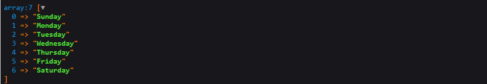

**<p align="center">Sunrise framework</p>**
=====================


**About the framework**
---------------------

Sunrise is a tool for creating simple and medium sites.
The Composer batch manager is used to implement dependencies

* [Server Requirements](##Server-requirements)
* [Instalation](#Installation-in-4-steps)
* [Configuration](##Configuration)
* [Getting started](#Getting-started)
* [Var dump](#Var-dump)

## Server Requirements
---------------------

* PHP >= 7.1.0
* PDO PHP Extension

**Installation in 4 steps**
---------------------

### **Step 1: First you need to clone this repository**


```
git clone https://github.com/Anton-94/Sunrise.git
```

### **Step 2: Update the dependencies with the command**

```
composer update
```

### **Step 3: Rename the file ```.env.example``` in ```.env```**

### **Step 4: Paste your settings into the .env file**

```
DB_CONNECTION=mysql
DB_HOST=localhost
DB_DATABASE=your_base
DB_PORT=3306
DB_USERNAME=your_name
DB_PASSWORD=your_password

```
## Configuration
-------------------
### **Environment Configuration**

Sunrise uses the dotenv package to configure your application.  
To add a new application configuration, simply add to the file .env desired value. Example:

```bash
APPLICATION_NAME=Sunrise
```
Loads environment variables from ```.env``` to ```getenv()```, ```$_ENV``` and ```$_SERVER``` automagically.
For more detailed information about environment variables you can read on [link](https://github.com/vlucas/phpdotenv)

**Getting started**
-------------------
### **Application Structure**
```
application/             main application folder
    Controllers/         contains controller classes
    Models/              contains model classes
    Views/               contains view files
configs/                 application configuration files
Engine/                  application engine
public/                  contains published asset files (javascript, css and so on)
vendor/                  application dependencies
.env                     environment variables of the application
index.php                the entry script for the application
```
### **Controllers and Actions**

First you need to create a controller and inherit the base class ```Controller``` and its constructor.
In the constructor, you must specify the base layout of your application. If the layout is not specified explicitly, the standard layout will be used ```application\Views\layouts\default.php``` 
```php
<?php

namespace Application\Controllers;

use Engine\Controller;

class DashboardController extends Controller
{
    /**
     * DashboardController constructor.
     * @param $di
     */
    public function __construct($di)
    {
        parent::__construct($di);
        $this->view->setLayout('main');
    }
}
```

### **Views**

Views contain the HTML served by your application and separate your controller / application logic from your presentation logic.
Views are stored in the ```application/Views``` directory.  
We may return it using the global ```view()``` helper.
```php
public function index()
{
    return view('index');
}
```
### **Routing**

All routes are defined in the routes file, which is located in the routes directory ```configs/routes```.  
This file is automatically loaded by the framework. To create a route, you must use the add () method.  
The simplest example of a route:
```php
$this->router->add('index', '/', 'DashboardController:index');
```
 
Of course, sometimes you will need to capture segments of the URI within your route. For example, you may need to capture a user's ID from the URL. You may do so by defining route parameters:
```php
$this->router->add('user', '/user/{id:int}', 'DashboardController:user');
```
You may define as many route parameters as required by your route:
```php
$this->router->add('user', '/user/{id:int}/role/{role:str}', 'DashboardController:user');
```
You should limit the format of your router parameters with one of the patterns:
```
int     only numbers
str     only string value and characters - _
any     string values, numbers, and characters  -  _
```
By default, all routes use the get method to send a request, you can override it by adding the desired method with the fourth parameter:
```php
$this->router->add('user', '/user/{id:int}/role/{role:str}', 'DashboardController:user', 'POST');
```
### **Models**
All models are stored in the ```application/Models``` folder.
After you create the model, you must inherit the Model class and its constructor and pass a variable to access the dependency store.  
And also set the table for this model
```php
class User extends Model
{
    public function __construct($di)
    {
        parent::__construct($di);

        $this->setTable('users');
    }
}
```
In order to use the model in the controller, you should connect it using the model () method of the Loader class. This class is already embedded in the Controller abstract class so you don’t have to worry about it.
```php
public function index()
{
    $user = $this->loader->model('User');

    return view('index');
}
```
**Var dump**
-------------------
Instead of the well-known var_dump() Sunrise uses Symfony's VarDumper component.  
Example:
```php
$week = [
    'Sunday',
    'Monday',
    'Tuesday',
    'Wednesday',
    'Thursday',
    'Friday',
    'Saturday',
];
dump($week);
```

